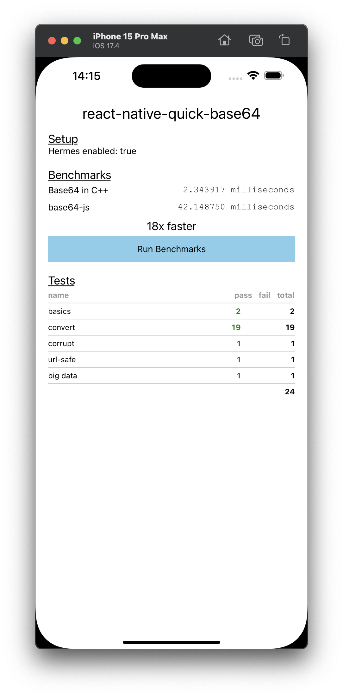
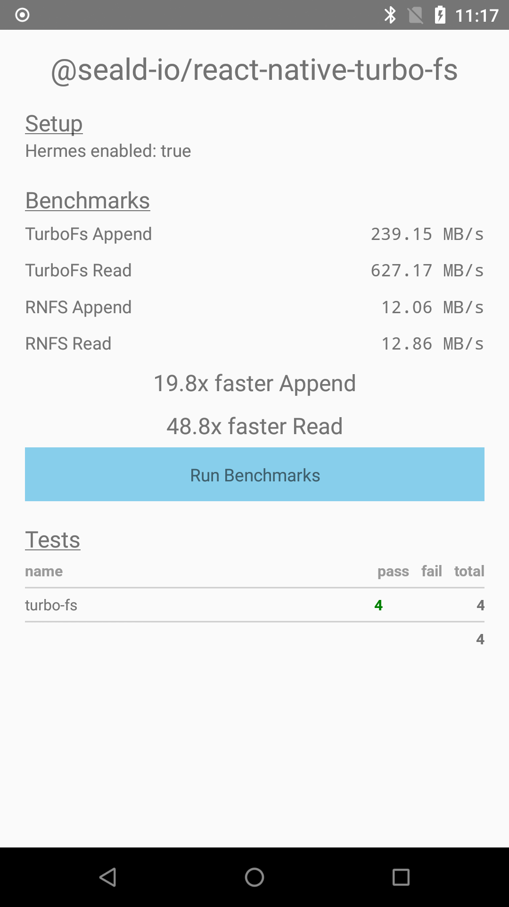

# @seald-io/react-native-turbo-fs

React-Native Turbo-module for fast FS operations with native ArrayBuffer support

~20x faster for Append and ~49x faster for Read than [react-native-fs](https://www.npmjs.com/package/react-native-fs) on a Nexus 5X, because it avoids having to Base64 / Unbase64 the data back and forth.

Try the benchmarks under [example](./example).

| iPhone                                            | Android                                            |
| ------------------------------------------------- | -------------------------------------------------- |
|  |  |

## Installation

```sh
npm install -S @seald-io/react-native-turbo-fs
```

## Usage

```js
import { read, append } from '@seald-io/react-native-turbo-fs'

const buffer = read('my-file-path', 512*1024, 0);

append('my-other-file', buffer);
```

## Methods

#### `read(filePath: string, size: number, position: number): ArrayBuffer`

Reads a chunk of size `size` from the file at `filePath`, starting from position `position`.

Returns an ArrayBuffer of the data read.

If the file is not long enough, it returns an ArrayBuffer of length of what was actually read.

If there is nothing to read at that position, it returns an ArrayBuffer of length 0.

#### `append(filePath: string, data: ArrayBuffer): void`

Appends the given data to the end of the file at `filePath`.

## Contributing

See the [contributing guide](CONTRIBUTING.md) to learn how to contribute to the repository and the development workflow.

## License

MIT by Seald SAS, based on the template of react-native-quick-base64 by Takuya Matsuyama
